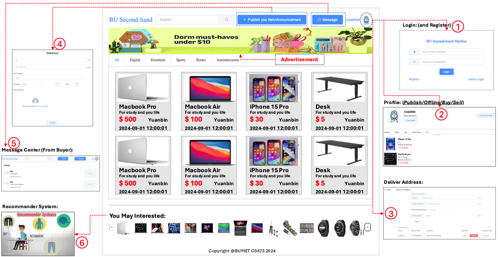
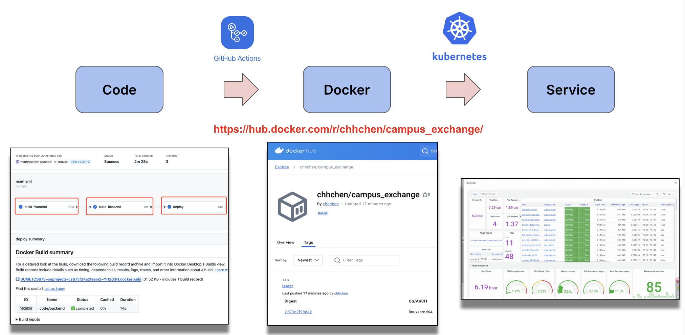

# Second-Hand Market

## Demo
  http://47.253.44.235:8080/
  
  > Dummy Link: For application demonstration only.
## Project Description

Second-hand trading is gaining popularity among university students. This platform, tailored for BU students, enables buying and selling of used items like phones, computers, and furniture, etc. It aims to offer a convenient way to trade goods within the university, promoting sustainability and benefiting the community. Our goal is to foster an eco-friendly, green, and inclusive environment. Technically, we use the latest tech stack. Since this is a B/S system, we use Java with Spring Boot and MySQL for the backend, and Node.js with Vue for the frontend. For CI/CD, we rely on GitHub Actions, and the system is deployed on the cloud using Docker and Kubernetes.

## Related Work

A few well-known examples include Facebook Marketplace, Craigslist, and OfferUp. These platforms allow users to buy and sell items within local communities. While they serve a broad audience, they do not focus on specific groups like university students. 

**Facebook Marketplace:** (1) Target Audience: Open to the general public, allowing people to buy and sell within their local areas.(2) Key Features: Offers item listings with images, location-based browsing, and integrated messaging. It also allows sellers to market to a larger audience.(3) Differences: Our platform is exclusive to BU students, fostering a sense of trust and community. Additionally, we emphasize sustainability by promoting the reuse of items within the university.

**Craigslist:** (1) Target Audience: Open to anyone, with categories ranging from jobs to housing to items for sale. (2) Key Features: A minimalistic user interface with text-based listings, location-based search, and simple buyer-seller communication. (3) Differences: Craigslist has a broad audience, but lacks the tailored, university-specific focus and a more modern, user-friendly interface. Our platform is specifically designed for BU students, with features like verified student accounts to enhance trust.

**OfferUp:** (1) Target Audience: General public, with a focus on local transactions. (2) Key Features: Mobile-friendly app, location-based item search, and built-in messaging for easy buyer-seller communication. (3) Differences: OfferUp is more polished but lacks the exclusive community focus. Our platform provides a safer and more trusted environment as all users are verified BU students.

Overall, while these platforms cater to a wider audience, our system's advantage lies in creating a secure, eco-conscious, and community-driven marketplace that addresses the specific needs of university students.

## Architecture

We constructed a RESTful API on our backend and accessed the data in the database through the mapper objects. Objects on the domain are used to represent object entities and the example objects generated by Mybatis represent the query that is used for querying the database. Then a model is based on the objects on the domain for returning data in a preferred format to the front end. Services are paired with interface and implementation. Service provides functionality to manipulate data through domain objects and mappers. Controllers provide the interface for the front end with a RESTful API architecture. Vo is similar to the model where it contains data in an organized fashion for ease of utilization. Util contains special classes that are utilized for special purposes. Other packages like enums, exceptions, and handlers are used as a standard when generating errors and exceptions.
The application's front end interacts with the data through the API and presents the data to the users.

## Requirements
 - Essential Features
    - **Login Page:** As a student role, Login page with phone number and password: Includes registration and admin login functionality.
    - **Register Page:** Register your account with a nickname, phone number, and password. Users should be prompted to re-enter the password for confirmation before submitting the registration.
    - **Administration Login:** An admin role is required. The login page should support login with phone number and password, and include both user registration and admin login functionality.
    - **Admin page:** The admin page should feature an item management subpage that displays both online and offline items with details like name, time, user, and an option to take items offline. It should also include order management, listing all market orders with full order details. Additionally, user management should list all platform users, with an option to ban users.
    - **Index Page:** The BU Second-Hand Market index page should include a search bar for users to search items by name, description, and more. The main section will display a list of items with pictures, name, description, price, location, and category. Additionally, it should feature a 'Publish Item' button, an announcement section, and a message center where users can view all messages from buyers or sellers.
    - **Publish Item:** The publish item page should include fields for title, description, category, location, price, and a picture upload option, followed by a submit button.
    - **Item Details:** Display all the item's information, including the picture, seller, title, and description, along with 'Buy Now' and 'Add to Cart' buttons. Users can also leave a message for the seller.
    - **Buy and Pay:** The buy and pay page appears after a user selects an item. It displays the item's details, allows the user to choose their address, and provides payment options. The user can either cancel the purchase or proceed with payment.
 - Desirable Features (the nice features that you really want to have too):
    - **Scrolling Recommendation:** The platform collects user clicks, messages, page views (PV), and unique visits (UV) to develop a recommendation algorithm that suggests items best suited to each user.
    - **Second-hand Assistance:** Utilizing the latest LLM technology, such as LLaMA, to offer an interactive chat feature that helps users quickly find items they are most interested in.
 - Optional Features (additional cool features that you want to have if there is time):

## CI/CD

Auto CI is now implemented (via **Github Actions**), automating the process for every code commit. CI config file location: [Click](.github/workflows/main.yml).

See GitHub Actions workflow: [Click](https://github.com/BUMETCS673/seprojects-cs673f24a2team2/actions). 

**Note**: Our CI workflow consists of 3 stages:
- Build Frontend: Compiling and packaging the frontend code.
- Build Backend: Compiling and packaging the backend code.
- Build, Dockerize, and Deploy: Building the Docker image and pushing it to Docker Hub [Click](https://hub.docker.com/r/chhchen/campus_exchange/).

You can download/pull our pre-built Docker image from Docker Hub to avoid manual compilation.

## Testing

Testing services with JUnit test. Then, the controller is tested with actual API calls by using postman and swagger ui. Front end is tested by using the developer tools on browser.

**Note**: Specific unit test refer to our STD file.

## Deployment

- From Source Code: refer to [Readme.md](./code/Readme.md) 

- From Docker:
  - docker pull chhchen/campus_exchange:latest
  - docker run -itd -p 8080:8080  chhchen/campus_exchange:latest

## Team Members
| Name   | Email | Role |
| :---------------- | :------ | :---- |
|Yingtong Zhou |cutejiu@bu.edu |  Team Leader|
|Yueyihan Qi |qyyh@bu.edu | Security Leader|
|Srujana N | sruju333@bu.edu| QA Leader|
|Ang Li |la1993@bu.edu | Design and Implementation Leader|
|Allen Chen |chhchen@bu.edu|Configuration Leader|
|Yuanbin Man |ybinman@bu.edu |Requirement Leader|
